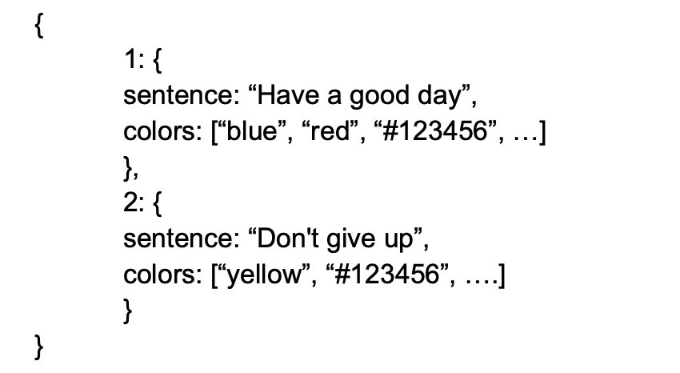

# Text-Highlighter

# Technologies
- Yarn
- Material UI
- React-ts


# Task
Create a text decoration editor. Each word can have a different color - attach, detach color to word. Also add functionality for removing certain words from text defined by the user.
The results can be exported as a JSON file.

## Functionality:
1. Upload text file (txt file).
2. Your can attach or detach color to word
3. Remove certain words
4. Download as JSON filе



## Tips:
1. You can use prototype or class inheritance.
2. The numbers in the array have corresponding words in a string. Word one will have blue color: Have - blue.
3. Use React with Redux to save state.
4. Add some styling using Sass.
```